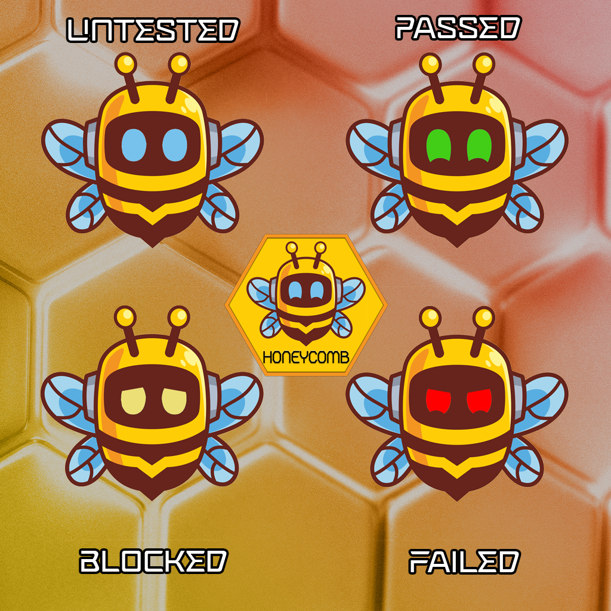

  

<h1 style="text-align: center;">Honeycomb Test Suite</h1>

  Honeycomb Test Suite is a currently in-development project to make a feature-rich QA Testing suite. 
  Star this repo to stay up to date!

<h1 style="text-align: center;">Test States</h1>

    
Each Test can be in 1 of 4 states

    <ol>
        <li> • Untested</li>
        <li> • Passed</li>
        <li> • Blocked</li>
        <li> • Failed</li>
    </ol>

  

  This README will be updated as new features as added/planned so stay tuned!

